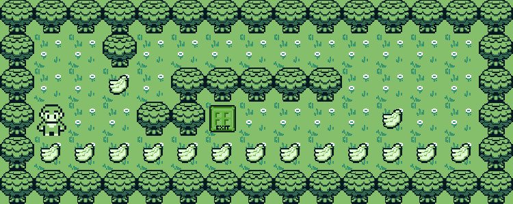

# 🕹️ So Long

**So Long** es un pequeño juego en 2D desarrollado en C utilizando la biblioteca `minilibx`. El objetivo del juego es que el jugador recoja todos los objetos del mapa y alcance la salida sin ser atrapado por los enemigos (si los hay).

## 📜 Descripción

El juego carga un mapa desde un archivo `.ber`, que define el diseño del escenario con paredes, caminos, coleccionables y una salida. El jugador debe moverse estratégicamente para recolectar todos los elementos antes de llegar a la salida.

### 🎮 Controles

- `WASD` o `Flechas`: Mover al personaje.  
- `ESC`: Salir del juego.  

### 🏗️ Compilación e Instalación

Para compilar el proyecto, ejecuta:

```bash
make
```
Esto generará el ejecutable so_long.

Para ejecutar el juego, usa:

````bash
./so_long maps/mapa1.ber
````

🖼️ Aquí tienes una vista previa del juego en acción:


